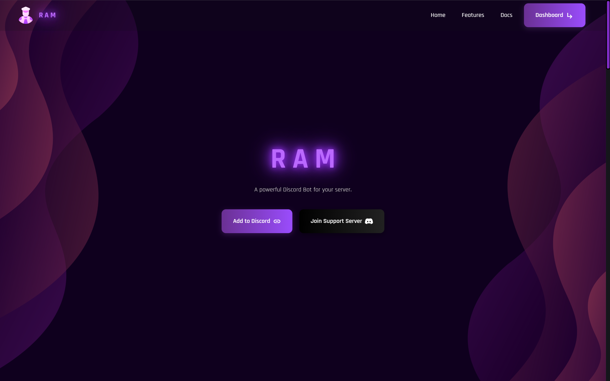

# RAM Discord Bot full Landing Page Template

## 🖼️ Preview

  
*Check out the live demo [here](not-added-yet) (will be added soon).*

## 📝 Project Overview

› This template is a free, sleek, and responsive landing page designed specifically for showcasing your Discord bot. It's easy to customize and perfect for both beginners and experienced developers. With this template, you can present your bot in a professional and engaging way.

› Additionally, the template includes a 404.html page for handling errors, ensuring your users are greeted with a custom error page if they visit a non-existent URL.

## 🛠️ Technologies Utilized

› Here’s a breakdown of the key technologies used to build this template:

- **Bootstrap**
- **HTML5 & CSS3**
- **JavaScript**
- **Mobirise** (Project file included - if you want, you can import the website and edit it via Mobirise)

## ⚙️ How to Set Up

› Follow these steps to set up the template:

1. **Clone or Fork the Repository**:  
   Run the following command to clone the repository:  
   `git clone https://github.com/1synom/free-discord-bot-website.git`
   
2. **Open the `index.html` file**:  
   Open the `index.html` file in your browser to view the template.

3. **Customize the Content**:  
   Edit the HTML, CSS, and JavaScript files to match your Discord bot’s details (name, description, features, etc.). Modify text, colors, images, and more.

4. **Deploy the Template**:  
   Once you're happy with the changes, you can host the template on platforms like GitHub Pages or Netlify to share your bot with the world!

## 📄 License

› This project is licensed under the [MIT License](https://opensource.org/licenses/MIT). Please refer to the [LICENSE](LICENSE) file for more details. If you use this template, credit would be appreciated!

## 🖼️ Image Credits & Licensing

› Some images used in this template come from external sources like Freepik and unDraw. Be sure to review and respect the licenses tied to these images:

- [Freepik License Agreement](https://www.freepikcompany.com/legal#nav-freepik)
- [unDraw License Agreement](https://undraw.co/license)

## 📧 Contact

› If you have any questions or feedback, feel free to reach out to me:

Discord: [1synom](https://discord.com/users/1197950944776818848)

